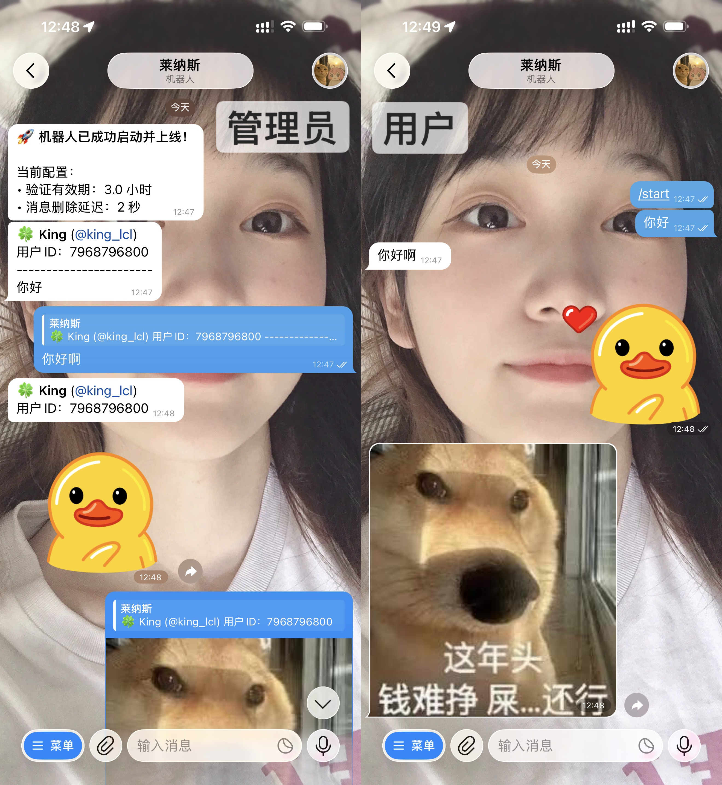

# 🤖 Telegram 私聊中转机器人 (Forward Bot)
参考项目：[dm-gateway-bot](https://github.com/ZenmoFeiShi/dm-gateway-bot)

这是一个基于 `python-telegram-bot` 开发的私聊中转机器人。它可以作为普通用户与管理员之间的沟通桥梁，支持全媒体消息转发，并内置身份验证功能。

## 🖼️ 界面演示


## 🌟 功能特性

* **极致纯净**：支持消息定时销毁，模拟真人 1-on-1 对话环境，实现机器人全感官透明。
* **全媒体支持**：支持文字、图片、视频、贴纸、语音、圆形视频消息、音频、文档及 GIF 动画的转发与回复。
* **身份验证 (Captcha)**：新用户首次发送消息需完成图形验证码校验，防止机器人骚扰。
* **自定义有效期**：支持通过环境变量 `EXPIRE_HOURS` 自定义验证过期的时长。
* **正则 ID 提取**：管理员直接回复转发的消息，系统自动通过正则匹配文本中的 `ID: xxxxx` 来识别目标用户。
* **启动通知**：机器人上线后会立即向管理员发送通知，并确认当前的过期时长设置。
* **Docker 友好**：完全支持通过环境变量进行配置部署。

## ⚙️ 环境变量配置

请在部署环境中设置以下变量（或在 `.env` 文件中定义）：

| 变量名 | 描述 | 默认值 |
| :--- | :--- | :--- |
| `BOT_TOKEN` | 从 [@BotFather](https://t.me/BotFather) 获得的机器人令牌 | 必填 |
| `OWNER_ID` | 管理员的 Telegram 数字 ID | 必填 |
| `EXPIRE_HOURS` | 验证有效期（单位：小时），超出这个时间联系需要重新验证。 | `2.0` |
| `DELETE_DELAY` | 闪速消息有效期（单位：秒），部分提醒信息到时自动删除，优化聊天体验 | `2.0` |

## 🚀 部署指南

### 1. 使用 Docker Compose (推荐)

创建 `docker-compose.yml` 文件：

> 获取自己的 Telegram ID：向 @userinfobot 发送任意消息即可。

```yaml
version: '3.8'

services:
  forward-bot:
    image: leonus888/tg_forward_bot:latest
    container_name: tg_forward_bot
    restart: always
    environment:
      - BOT_TOKEN=YOUR_BOT_TOKEN # 必填
      - OWNER_ID=YOUR_Telegram_ID # 必填
      - EXPIRE_HOURS=2 # 可删除，默认2小时
      - DELETE_DELAY=2 # 可删除，默认2秒
```
运行命令启动：

```Bash
docker compose up -d
```

### 2. 本地运行

#### 安装依赖：

```Bash
pip install -r requirements.txt
```

#### 配置 `.env` 文件。

先改成 `.env`

```Bash
cp .env.example .env
```

编辑 `.env` 文件
```Bash
BOT_TOKEN=your_bot_token_here   # 从 @BotFather 获取
OWNER_ID=your_telegram_user_id  # 你的 Telegram 数字 ID
```
> 获取自己的 Telegram ID：向 @userinfobot 发送任意消息即可。

#### 启动程序：

```Bash
python bot.py
```

## 📖 管理员操作指南

* **接收消息**：机器人会将用户消息转发给您，并在顶部显示用户信息及 ID: {user_id} 标记。
* **回复用户**：在 Telegram 中**右键点击（或长按）**该消息，选择 **“回复 (Reply)”**，输入内容后发送即可。
* **系统识别**：机器人会自动识别回复文本中的 ID 并将内容回传给对应用户。

## ⚠️ 注意事项

* **安全提示**：请妥善保管您的 BOT_TOKEN，切勿泄露给他人。
* **环境要求**：建议使用 Python 3.10 或更高版本运行。
